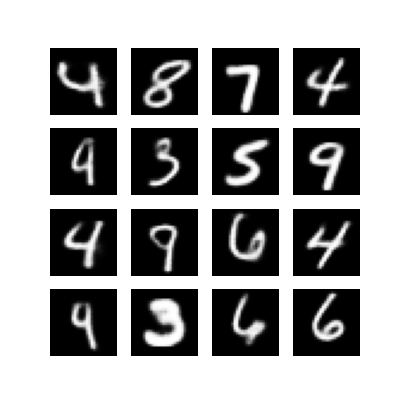

# Variational AutoEncoder

Implementations of Variational AutoEncoder model from [Auto-Encoding Variational Bayes](https://arxiv.org/abs/1312.6114) article.
Model is tested on MNIST data.

### Example of generated digits

## Requirements
* tensorflow > 2
* numpy
* matplotlib 
